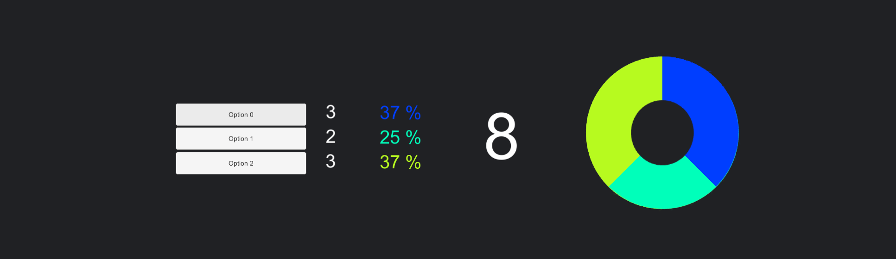
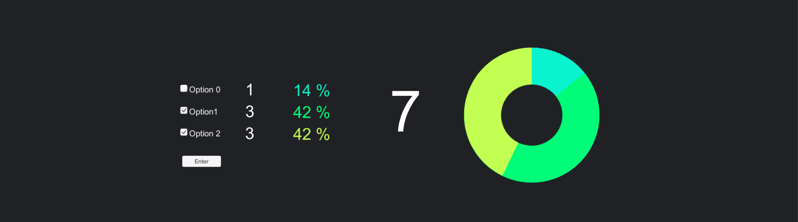
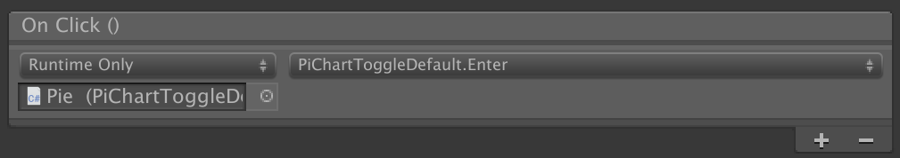
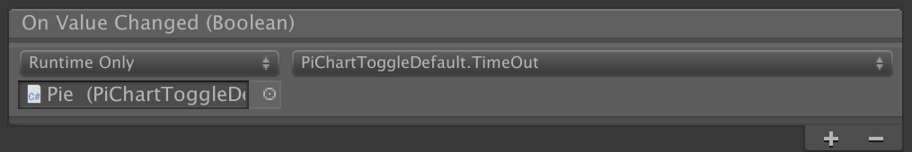

# Survey - PieChart - Unity 2D

#### Unity 2D - 2018.3.1f1
App that make a percentage / Pie Chart / of the clicks on the buttons.

# CONSTRUCTION
### Buttons only:
- Script on the GameObject "Pie"
- > Assets/Script/Contruction/PieChart.cs

### Toggle Buttons:
- Multiple choice
- Enter button (only when something is selected)
- Thanks page (3s.)
- Reset timer (60s.)
- Script on the GameObject "Pie"
- > Assets/Script/Contruction/PieChartToggleDefault.cs _*_

### ToggleGroup Buttons:
- One choice
- Enter button (only when something is selected)
- Thanks page (3s.)
- Reset timer (60s.)
- Script on the GameObject "Pie"
- > Assets/Script/Contruction/PieChartToggleDefault.cs _*_

**_*_**
Same Script 

# Don't Forget!

### Enter Button:

-> in the inspector:
- On click() called the "Enter" public function inside the script
- Script on the GameObject "Pie"

### Toggle Option:

-> in the inspector:
- On click() called the "TimeOut" public function inside the script
- Script on the GameObject "Pie"
- This function reset the options if no ones press enter in the next 60s.

