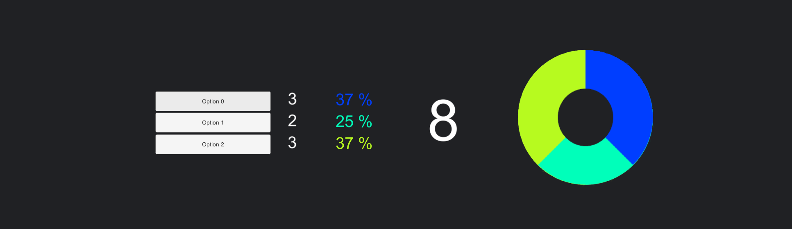
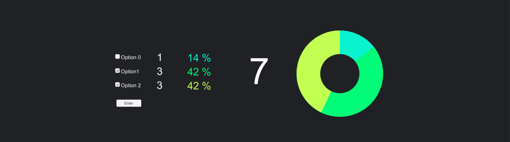
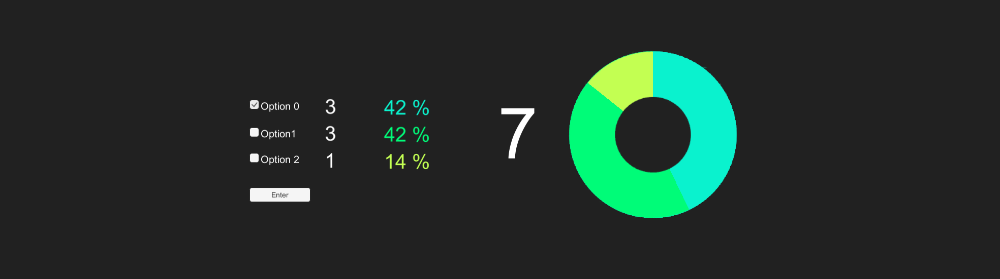

# Survey - PieChart - Unity 2D

Unity 2D app that make a percentage / Pie Chart / of the clicks on the buttons.

# CONSTRUCTION
### Buttons only:
- > Assets/Script/Contruction/PieChart.cs

### Toggle Buttons:
- Multiple choice
- Enter button (only when something is selected)
- Thanks page (3s.)
- Reset timer (60s.)
- Participants number
- > Assets/Script/Contruction/PieChartToggleDefault.cs _*_

### ToggleGroup Buttons:
- One choice
- Enter button (only when something is selected)
- Thanks page (3s.)
- Reset timer (60s.)
- Participants number
- > Assets/Script/Contruction/PieChartToggleDefault.cs _*_

**_*_**
Same Script 

